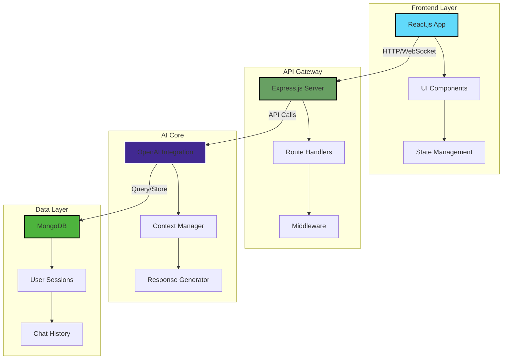

<div align="center">

# 🧠 **CognitAI**

### *Next-Generation AI-Powered Cognitive Assistant Platform*

[](https://github.com/VAMSHIYADAV46/CognitAI)
[](https://github.com/VAMSHIYADAV46/CognitAI/stargazers)
[](https://github.com/VAMSHIYADAV46/CognitAI/commits)
[](https://github.com/VAMSHIYADAV46/CognitAI/issues)
[](LICENSE)

[](https://reactjs.org/)
[](https://nodejs.org/)
[](https://www.mongodb.com/)
[](https://openai.com/)

[**Live Demo**]() • [**Documentation**](https://github.com/VAMSHIYADAV46/CognitAI/wiki) • [**Report Bug**](https://github.com/VAMSHIYADAV46/CognitAI/issues) • [**Request Feature**](https://github.com/VAMSHIYADAV46/CognitAI/issues)

</div>

---

## 🚀 **Introduction**

**CognitAI** revolutionizes human-AI interaction by delivering an intelligent, context-aware assistant that understands, learns, and adapts to your unique needs. Built with cutting-edge technologies and a modern full-stack architecture, CognitAI bridges the gap between artificial intelligence and practical productivity.

### 💡 **The Problem**
Traditional AI assistants lack contextual understanding, struggle with complex queries, and fail to maintain coherent long-form conversations. Users need a smarter, more intuitive solution that truly understands their intent and delivers actionable insights.

### ✨ **Our Solution**
CognitAI leverages state-of-the-art language models combined with intelligent session management and a responsive, user-friendly interface to create meaningful AI interactions that boost productivity and enhance decision-making.

### 🎯 **What Makes CognitAI Unique**
- **Persistent Context Memory**: Maintains conversation history across sessions
- **Adaptive Intelligence**: Learns from user interactions to provide personalized responses
- **Modular Architecture**: Easily extensible with plugins and custom AI models
- **Enterprise-Ready**: Scalable backend with robust error handling and session management
- **Beautiful UX**: Clean, modern interface with Markdown rendering and responsive design

---

## ⚡ **Features**

<table>
<tr>
<td width="50%">

### 🎨 **User Experience**
- 💬 **Real-time Chat Interface** - Seamless conversation flow
- 📝 **Markdown Support** - Rich text formatting
- 🎭 **Multiple Personas** - Switch between AI personalities
- 📱 **Responsive Design** - Works on all devices
- 🌗 **Dark/Light Mode** - Eye-friendly themes

</td>
<td width="50%">

### 🛠️ **Technical Capabilities**
- 🧠 **Context-Aware AI** - Understands conversation history
- ⚡ **Fast Response Time** - Optimized API calls
- 🔐 **Secure Sessions** - Protected user data
- 📊 **Analytics Dashboard** - Track usage metrics
- 🔌 **Plugin System** - Extend functionality

</td>
</tr>
</table>

---

## 🏗️ **System Architecture**



---

## 🛠️ **Tech Stack**

| Category | Technology | Description |
|----------|------------|-------------|
| **Frontend** |  | Component-based UI library |
| **Styling** |  | Utility-first CSS framework |
| **Backend** |  | JavaScript runtime |
| **Framework** |  | Web application framework |
| **Database** |  | NoSQL database |
| **AI/ML** |  | GPT-4 language model |
| **Auth** |  | JSON Web Tokens |
| **Testing** |  | Testing framework |

---

## 📦 **Installation & Setup**

### **Prerequisites**
- Node.js 18.x or higher
- MongoDB 6.0 or higher
- npm or yarn package manager
- OpenAI API key

### **1️⃣ Clone the Repository**

```bash
git clone https://github.com/VAMSHIYADAV46/CognitAI.git
cd CognitAI
```

### **2️⃣ Backend Setup**

```bash
# Navigate to backend directory
cd backend

# Install dependencies
npm install

# Create environment variables
cp .env.example .env

# Configure your .env file
nano .env
```

**Environment Variables (.env):**
```env
# Server Configuration
PORT=5000
NODE_ENV=development

# Database
MONGODB_URI=mongodb://localhost:27017/cognitai
DB_NAME=cognitai

# OpenAI API
OPENAI_API_KEY=your_openai_api_key_here
OPENAI_MODEL=gpt-4

# Session
SESSION_SECRET=your_session_secret_here
JWT_SECRET=your_jwt_secret_here

# CORS
FRONTEND_URL=http://localhost:3000
```

```bash
# Start MongoDB service
sudo systemctl start mongodb

# Run backend server
npm run dev
```

### **3️⃣ Frontend Setup**

```bash
# Open new terminal and navigate to frontend
cd ../frontend

# Install dependencies
npm install

# Create environment variables
cp .env.example .env

# Configure frontend .env
REACT_APP_API_URL=http://localhost:5000/api

# Start development server
npm start
```

### **4️⃣ Access the Application**

Open your browser and navigate to:
- Frontend: `http://localhost:3000`
- Backend API: `http://localhost:5000/api`

---

## 💻 **Usage**

### **Getting Started**

1. **Sign Up/Login**: Create an account or use demo credentials
2. **Start Chatting**: Type your message in the input field
3. **Explore Features**: Try different prompts and commands

### **Example Interactions**

```markdown
User: "Help me write a Python function to calculate fibonacci numbers"

CognitAI: Here's an efficient Python function for calculating Fibonacci numbers:
```python
def fibonacci(n):
    if n <= 1:
        return n
    a, b = 0, 1
    for _ in range(2, n + 1):
        a, b = b, a + b
    return b
```


<!-- ### **Demo Screenshots**

| Chat Interface | Dashboard | Settings |
|----------------|-----------|----------|
|  |  |  | -->

---

## 🗺️ **Roadmap**

### **Phase 1: Foundation** ✅
- [x] Basic chat interface
- [x] OpenAI integration
- [x] MongoDB setup
- [x] Session management

### **Phase 2: Enhancement** 🚧
- [ ] User authentication system
- [ ] Chat history persistence
- [ ] Dark mode toggle
- [ ] Export conversations
- [ ] Search functionality

### **Phase 3: Advanced Features** 📋
- [ ] Multi-model support (Claude, Gemini, LLaMA)
- [ ] Voice input/output
- [ ] File upload and analysis
- [ ] Custom AI personas
- [ ] Collaborative sessions

### **Phase 4: Enterprise** 🎯
- [ ] Admin dashboard
- [ ] Usage analytics
- [ ] Team workspaces
- [ ] API rate limiting
- [ ] Webhook integrations

### **Phase 5: Deployment** 🚀
- [ ] Docker containerization
- [ ] Kubernetes orchestration
- [ ] CI/CD pipeline
- [ ] Cloud deployment (AWS/GCP/Azure)
- [ ] Performance monitoring

---

## 🤝 **Contributing**

We welcome contributions from the community! Here's how you can help:

### **Development Workflow**

1. **Fork the Repository**
   ```bash
   git clone https://github.com/YOUR_USERNAME/CognitAI.git
   ```

2. **Create Feature Branch**
   ```bash
   git checkout -b feature/AmazingFeature
   ```

3. **Make Your Changes**
   - Write clean, documented code
   - Follow existing code style
   - Add tests for new features

4. **Commit Changes**
   ```bash
   git add .
   git commit -m "✨ Add AmazingFeature"
   ```

5. **Push to Branch**
   ```bash
   git push origin feature/AmazingFeature
   ```

6. **Open Pull Request**
   - Provide clear description
   - Reference related issues
   - Include screenshots if applicable

### **Commit Convention**
- ✨ `:sparkles:` New features
- 🐛 `:bug:` Bug fixes
- 📚 `:books:` Documentation
- 🎨 `:art:` Code style
- ⚡ `:zap:` Performance
- 🔧 `:wrench:` Configuration

---

## 📄 **License**

This project is licensed under the MIT License - see the [LICENSE](LICENSE) file for details.

```
MIT License

Copyright (c) 2024 Mekala Vamshi Yadav

Permission is hereby granted, free of charge, to any person obtaining a copy
of this software and associated documentation files (the "Software"), to deal
in the Software without restriction...
```

---
## 🙏 **Acknowledgements**

### **Special Thanks To:**
- 🤖 [OpenAI](https://openai.com/) - For GPT-4 API
- ⚡ [Groq](https://groq.com/) - For Groq LLM

- ⚛️ [React Team](https://reactjs.org/) - For the amazing framework  
- 🟢 [Node.js Community](https://nodejs.org/) - For the runtime  
- 🍃 [MongoDB Team](https://www.mongodb.com/) - For the database  
- 🎨 [Tailwind CSS](https://tailwindcss.com/) - For styling utilities  
- 💎 All contributors and supporters  

### **Inspirations:**
- ChatGPT - Conversational AI interface
- Notion AI - Productivity enhancements
- GitHub Copilot - Developer assistance


---


## 👨‍💻 **Author**

<div align="center">

### **Mekala Vamshi Yadav**

[](https://github.com/VAMSHIYADAV46)
[](https://linkedin.com/in/mekalavamshiyadav)
[](https://vamshiyadav.dev)

</div>

---

## 🔗 **Project Links**

- 🌐 **Repository**: [https://github.com/VAMSHIYADAV46/CognitAI](https://github.com/VAMSHIYADAV46/CognitAI)
- 📖 **Documentation**: [https://github.com/VAMSHIYADAV46/CognitAI/wiki](https://github.com/VAMSHIYADAV46/CognitAI/wiki)
- 🐛 **Issue Tracker**: [https://github.com/VAMSHIYADAV46/CognitAI/issues](https://github.com/VAMSHIYADAV46/CognitAI/issues)
- 💬 **Discussions**: [https://github.com/VAMSHIYADAV46/CognitAI/discussions](https://github.com/VAMSHIYADAV46/CognitAI/discussions)

---

<div align="center">

**⭐ Star this repository if you find it helpful!**

Made with ❤️ by [Mekala Vamshi Yadav](https://github.com/VAMSHIYADAV46)

</div>
